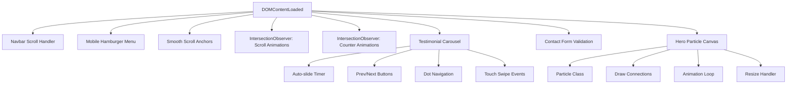

<div align="center">

# ⚡ CanggihinAja

### *Your Brand. Our Technology.*

[](https://developer.mozilla.org/en-US/docs/Web/HTML)
[](https://developer.mozilla.org/en-US/docs/Web/CSS)
[](https://developer.mozilla.org/en-US/docs/Web/JavaScript)
[](https://fontawesome.com/)

<br/>

**A stunning, premium white-label IT products website** built with pure HTML, CSS & JavaScript.  
Featuring glassmorphism UI, particle animations, dynamic counters, and a fully responsive design.

<br/>

[🚀 Live Demo](#-quick-start) · [📖 Features](#-features) · [🏗️ Architecture](#%EF%B8%8F-project-structure) · [🤝 Contributing](#-contributing)

---

</div>

<br/>

## 📸 Preview

<div align="center">

| Hero Section | Products Grid |
|:---:|:---:|
| Dark gradient hero with particle canvas animation, floating glassmorphism cards, and animated counters | 6 product cards with hover effects, gradient accent bars, and staggered scroll animations |

| Pricing Plans | Contact Form |
|:---:|:---:|
| 3-tier pricing with featured "Most Popular" card and gradient CTA buttons | Validated contact form with real-time error feedback and success animation |

</div>

<br/>

## ✨ Features

<table>
<tr>
<td width="50%">

### 🎨 Design & UI
- 🌌 **Particle Canvas** — Animated hero background with floating connected particles
- 🪟 **Glassmorphism** — Frosted-glass cards with backdrop-filter blur effects
- 🎭 **Dual Gradients** — Blue & Red gradient system for visual hierarchy
- ✨ **Micro-animations** — Hover effects, shimmer logos, floating cards
- 📱 **Fully Responsive** — Mobile-first design with hamburger navigation

</td>
<td width="50%">

### ⚙️ Functionality
- 🔢 **Animated Counters** — Count-up with cubic ease-out on scroll
- 🎠 **Testimonial Carousel** — Auto-sliding with touch-swipe support
- 📝 **Form Validation** — Real-time client-side validation with error states
- 🧭 **Smooth Scrolling** — Nav-aware smooth scroll with offset calculation
- 👁️ **Intersection Observer** — Staggered scroll-triggered animations

</td>
</tr>
</table>

<br/>

## 🛠️ Tech Stack

```
📦 CanggihinAja
│
├── 🏗️ HTML5          → Semantic structure with SEO meta tags
├── 🎨 CSS3           → Custom properties, Grid, Flexbox, Glassmorphism
│   ├── Google Fonts   → Inter (body) + Outfit (headings)
│   └── Font Awesome   → Icon library (v6.5.1)
└── ⚡ JavaScript      → Vanilla ES6+ with modular architecture
    ├── Canvas API     → Particle system with connection lines
    ├── IntersectionObserver → Scroll-driven animations & counters
    └── Touch Events   → Mobile swipe gestures for carousel
```

<br/>

## 🏗️ Project Structure

```
webcanggihin/
├── index.html          # Main HTML — 631 lines of semantic markup
│   ├── Navigation      # Fixed navbar with scroll effect & mobile menu
│   ├── Hero            # Canvas particles + glassmorphism cards + stats
│   ├── Products        # 6 product cards (SaaS, Mobile, CRM, E-Com, Analytics, Cloud)
│   ├── Features        # 6 feature highlights with icon + description
│   ├── Pricing         # 3-tier pricing (Starter $299, Pro $799, Enterprise Custom)
│   ├── Testimonials    # Carousel with 3 client testimonials
│   ├── About           # Company info + animated stat counters
│   ├── Contact         # Validated form + company contact info
│   └── Footer          # 4-column footer with social links
│
├── styles.css          # Design system — 1,666 lines
│   ├── CSS Variables   # Colors, gradients, shadows, typography, spacing
│   ├── Components      # Buttons, cards, forms, navigation
│   ├── Animations      # @keyframes: shimmer, pulse-dot, float, fadeUp
│   └── Responsive      # Mobile breakpoints & adaptive layouts
│
├── script.js           # Interactivity — 291 lines
│   ├── Navbar          # Scroll-based background transition
│   ├── Hamburger       # Mobile menu toggle with body scroll lock
│   ├── Smooth Scroll   # Anchor navigation with navbar offset
│   ├── Scroll Observer # Staggered reveal animations
│   ├── Counter Anim    # Count-up with requestAnimationFrame
│   ├── Carousel        # Auto-slide, nav buttons, dots, touch swipe
│   ├── Form Validation # Client-side validation with UX feedback
│   └── Particle Canvas # Dynamic particle system with connections
│
└── README.md           # You are here! 📍
```

<br/>

## 🚀 Quick Start

### Prerequisites

All you need is a modern web browser! No build tools, no dependencies, no package managers.

### Run Locally

```bash
# 1. Clone the repository
git clone https://github.com/hannyyosephine16/webcanggihin.git

# 2. Navigate to the project
cd webcanggihin

# 3. Open in browser (pick one)
open index.html            # macOS
xdg-open index.html        # Linux
start index.html           # Windows

# Or use a local server for best results
npx serve .
# → http://localhost:3000
```

<br/>

## 🎯 Page Sections

<details>
<summary><b>🏠 Navigation</b> — Fixed glassmorphism navbar</summary>

- Transparent on top, blurred dark background on scroll
- Smooth scroll to sections with navbar height offset
- Mobile hamburger menu with animated open/close
- CTA button styled differently from nav links

</details>

<details>
<summary><b>🦸 Hero Section</b> — Full-screen dark gradient with particles</summary>

- **Canvas particle system** with dynamic connections between nearby particles
- **Glassmorphism cards** floating with CSS keyframe animations
- **Animated stat counters** — 150+ Products, 98% Satisfaction, 24/7 Support
- **Dual CTA buttons** — "Explore Products" (blue) & "Request Demo" (outlined)

</details>

<details>
<summary><b>📦 Products</b> — 6 white-label product cards</summary>

| Product | Icon | Description |
|---------|------|-------------|
| SaaS Platforms | ☁️ | Multi-tenant apps with subscription management |
| Mobile Apps | 📱 | Cross-platform iOS & Android applications |
| CRM Solutions | 👥 | Pipeline tracking, automation & analytics |
| E-Commerce | 🛒 | Payment integration & inventory management |
| Analytics Dashboard | 📊 | Real-time data visualization & BI reports |
| Cloud Infrastructure | 🖥️ | Scalable hosting with automated deployments |

</details>

<details>
<summary><b>🌟 Features</b> — 6 key differentiators</summary>

- 🎨 **Complete Custom Branding** — Logo, colors, domain customization
- 🔌 **API-First Architecture** — RESTful APIs & webhook integrations
- 🎧 **24/7 Dedicated Support** — Round-the-clock expert assistance
- 📈 **Infinite Scalability** — Cloud-native, 10 to 10M users
- 🛡️ **Enterprise Security** — SOC 2, E2E encryption, SSO, RBAC
- ⚡ **Rapid Deployment** — Concept to launch in under 48 hours

</details>

<details>
<summary><b>💰 Pricing</b> — 3-tier pricing model</summary>

| Plan | Price | Users | Products | Support |
|------|-------|-------|----------|---------|
| **Starter** | $299/mo | 1,000 | 1 | Email |
| **Professional** ⭐ | $799/mo | 25,000 | 5 | Priority 24/7 |
| **Enterprise** | Custom | Unlimited | Unlimited | Phone & Slack |

</details>

<details>
<summary><b>💬 Testimonials</b> — Auto-sliding carousel</summary>

- 3 client testimonials with avatar initials and role info
- Navigation via prev/next buttons, dot indicators, or touch swipe
- Auto-advances every 5 seconds, pauses on interaction

</details>

<details>
<summary><b>📞 Contact</b> — Validated inquiry form</summary>

- **Fields**: Name*, Email*, Company, Product Interest (dropdown), Message*
- Real-time validation with visual error states
- Success animation after submission
- Contact info: email, phone, address, business hours

</details>

<br/>

## 🎨 Design System

### Color Palette

```
Blue Scale          Red Accent         Neutrals
──────────          ──────────         ────────
#0a1628  ████       #dc2626  ████      #0f172a  ████  900
#0f2042  ████       #ef4444  ████      #1e293b  ████  800
#15316b  ████       #f87171  ████      #334155  ████  700
#1a42a0  ████       #fca5a5  ████      #475569  ████  600
#2563eb  ████  ← Primary              #64748b  ████  500
#3b82f6  ████                          #94a3b8  ████  400
#60a5fa  ████                          #f8fafc  ████  50
```

### Typography

| Role | Font | Weights |
|------|------|---------|
| **Headings** | [Outfit](https://fonts.google.com/specimen/Outfit) | 400 – 800 |
| **Body** | [Inter](https://fonts.google.com/specimen/Inter) | 300 – 700 |

### Key CSS Techniques

- **CSS Custom Properties** — 40+ design tokens for consistent theming
- **CSS Grid + Flexbox** — Responsive layouts without frameworks
- **Glassmorphism** — `backdrop-filter: blur()` with semi-transparent backgrounds
- **Gradient Clipping** — Text with gradient fill via `background-clip: text`
- **CSS Animations** — `@keyframes` for float, shimmer, pulse, fadeUp

<br/>

## 🔧 JavaScript Architecture



<br/>

## 📱 Responsive Breakpoints

| Breakpoint | Target | Key Adaptations |
|:----------:|--------|-----------------|
| `< 768px` | 📱 Mobile | Hamburger menu, single-column grids, adjusted font sizes |
| `768px – 1024px` | 📱 Tablet | 2-column product/pricing grids, compact hero layout |
| `> 1024px` | 💻 Desktop | Full 3-column grids, side-by-side hero content & visual |

<br/>

## 🤝 Contributing

Contributions are welcome! Here's how to get involved:

```bash
# 1. Fork the repo

# 2. Create your feature branch
git checkout -b feature/amazing-feature

# 3. Commit your changes
git commit -m "feat: add amazing feature"

# 4. Push to branch
git push origin feature/amazing-feature

# 5. Open a Pull Request
```

<br/>

## 📄 License

This project is open-source and available under the [MIT License](LICENSE).

<br/>

---

<div align="center">

**Built with ❤️ by the CanggihinAja Team**

⚡ *Your Brand. Our Technology.* ⚡

<br/>

[](https://github.com/hannyyosephine16/webcanggihin)

</div>
